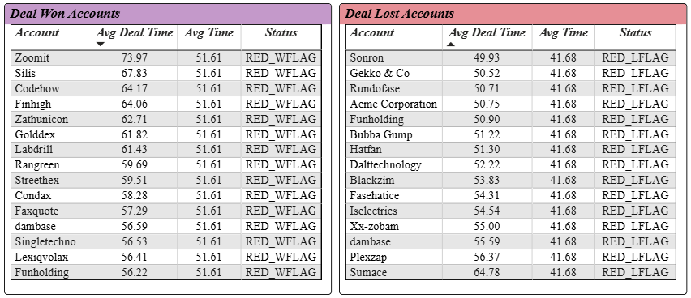

# 📊 Sales Insights & Optimization Dashboard

This project demonstrates how data-driven insights can drive better sales strategy, agent performance, and customer retention.  
It is divided into two parts:

- ✅ **SQL Analysis** – Extracting actionable insights via analytical queries  
- 📈 **Power BI Dashboard** – Visualizing KPIs and patterns across the sales lifecycle  

---

## 🔍 Business Questions Answered

1. What drives high-value deals and who closes them?
2. Where are the bottlenecks in the sales funnel?
3. How long do deals take to close by industry?
4. Which accounts are at risk of churn?
5. How does sales performance vary by month or season?
6. Which agents, products, and industries perform best?

---

## ✅ SQL Analysis

Each section below includes:
- 🎯 SQL Objective
- 📄 Query link
- 📊 BI Visualization
- 💡 Business Insight

---

### 1. 🔍 Predicting High-Value Deals Using Revenue Percentile Analysis

**🎯 Objective:**  
Classify deals into high, mid, and low-value segments using revenue percentiles and identify which sales agents close the most high-value deals.

📄 [View SQL Query](sql/high_value_deals.sql)

🖼️   

**💡 Insight:**  
Highlights top-performing agents based on high-value wins — helps prioritize strategic leads and inform bonus structures.

---

### 2. 🔄 Sales Funnel Velocity & Drop-Off Analysis

**🎯 Objective:**  
Identify which accounts are moving faster or slower through different deal stages and can highlight bottlenecks.

📄 [View SQL Query](sql/sales_pipeline_velocity.sql)

🖼️ 

**💡 Insight:**  
Accounts with deals taking longer than average to close—whether won or lost—highlight inefficiencies in the sales process. 
Addressing these delays can improve overall pipeline velocity and conversion rates.

---

### 3. ⏱️ Average Deal Closing Time by Industry

**🎯 Objective:**  
Calculate the average time it takes to close a deal per industry to assess sales cycle variation.

📄 [View SQL Query](sql/avg_deal_close_time.sql)

🖼️ 

**💡 Insight:**  
This analysis reveals the average time taken to close deals across different industries, highlighting sectors with faster or slower sales cycles.

---

### 4. 📉 Churn Risk Analysis Based on Deal Loss Patterns

**🎯 Objective:**  
This query identifies accounts with a high risk of churn by calculating the lost deal percentage and the time gap since their last won deal.

📄 [View SQL Query](sql/churn_risk_accounts.sql)

🖼️ 

**💡 Insight:**  
This analysis identifies accounts at high risk of churn by flagging those with a high percentage of lost deals (≥35%) and a long gap since their last won deal,
helping prioritize retention efforts.

---

### 5. 📅 Sales Seasonality & Revenue Impact Analysis

**🎯 Objective:**  
This query identifies seasonal trends in sales performance by analyzing revenue fluctuations across months.

📄 [View SQL Query](sql/revenue_seasonality.sql)

🖼️ 

**💡 Insight:**  
This analysis reveals monthly sales seasonality by aggregating total revenue and deal counts, helping identify peak periods and optimize sales planning accordingly.

---

## 📊 Power BI Dashboard (3 Pages)

This interactive dashboard visualizes the insights uncovered through SQL — covering key sales metrics, product comparisons, and funnel performance by region. 
Built with custom DAX, slicers, drill-throughs, and bookmarks for dynamic exploration.

> Built using Power BI Desktop – includes DAX measures, calculated columns, and relationships.

> 📁 [Download Power BI File](power_bi/Sales_dashboard.pbix)

### 📈 Page 1: Sales Performance Overview  
This page highlights key sales metrics and performance breakdowns:

- **KPIs**: Total Revenue, Deals Won, Average Deal Size, Win Rate, Avg Days to Close  
- **Breakdowns** by industry, account, and agent performance  
- **Tables and charts** showing top agents by revenue and deal volume  
- **Interactive features**: metric toggle (by sector), region filter, drill-through to product view, and bookmarks for switching table and sales views  

---

### 📉 Page 2: Product Sales Comparison
Designed to enable clear, side-by-side comparisons of product sales performance, this page:

- Side-by-side visuals showing **top products by revenue** and **deals won**  
- Slicers to toggle between metrics including **revenue**, **deals won**, and **MoM sales %**  
- Detailed **product-level table** for granular insights  
- **Reset button** to clear slicers and drill-through filters from Page 1  

---

### 🧭 Page 3: Regional & Funnel Performance Analysis  
This page provides a detailed view of regional sales results and funnel stage performance:

- **KPIs**: Engage Conversion, Closed Conversion, Loss Rate, Win Rate  
- **Breakdowns** by region, manager, and agent performance  
- **Tables and charts** showing revenue, deal size, win rates, and funnel drop-offs  
- **Interactive features**: region and account filters, dynamic highlights, and drill-downs to agent-level insights  

---

## 📁 Files Included

- `sql/` folder – All business queries
- `power_bi/` – Power BI `.pbix` file and visual exports
- `data/` – Sample dataset to test or recreate

---

## ✅ Key Skills Demonstrated

- Writing advanced SQL for business insights & KPIs  
- Data cleaning with Power Query  
- Data modeling and DAX in Power BI  
- Dashboard design with drilldowns, trends, bookmarks  
- Analytical storytelling using interactive visuals  

---

## 💡 Future Improvements
- Automate data refresh from SQL to Power BI
- Add ML scoring (propensity to churn, lead scoring)

